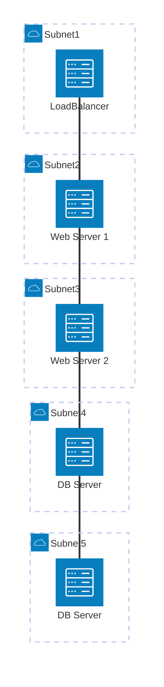

SSH トンネル
===

## SSH トンネルを構成する SSH サーバが 1 台の場合

### ネットワーク構成

- PC

    ```bash
    sudo ip link set dev ens34 up
    sudo ip addr add 10.1.1.1/24 dev ens34
    ```

- SSH Server

    ```bash
    sudo ip link set dev ens34 up
    sudo ip addr add 10.1.1.2/24 dev ens34
    ```

    ```bash
    sudo ip link set dev ens35 up
    sudo ip addr add 10.1.2.1/24 dev ens35
    ```

- Server

    ```bash
    sudo ip link set dev ens34 up
    sudo ip addr add 10.1.2.2/24 dev ens34
    ```


### PC で実行する SSH ポートフォワーディングのコマンド

- PC -> SSHトンネル -> Server の場合

    PC の localhost:8080 を使って、リモートネットワークの 10.1.2.2:80 に接続する場合は下記のコマンドを実行します。

    ```bash
    ssh -N -L 8080:10.1.2.2:80 ubuntu@10.1.1.2
    ```

- SSH サーバ:80 -> Server の場合

    ```bash
    ssh -N -L 0.0.0.0:8080:10.1.2.2:80 ubuntu@10.1.2.2
    ```


## SSH トンネルを構成する SSH サーバが 2 台の場合

### ネットワーク構成

- PC

    ```bash
    sudo ip link set dev ens34 up
    sudo ip addr add 10.1.1.1/24 dev ens34
    ```

- SSH Server1

    ```bash
    sudo ip link set dev ens34 up
    sudo ip addr add 10.1.1.2/24 dev ens34
    ```

    ```bash
    sudo ip link set dev ens35 up
    sudo ip addr add 10.1.2.1/24 dev ens35
    ```

- SSH Server2

    ```bash
    sudo ip link set dev ens34 up
    sudo ip addr add 10.1.2.2/24 dev ens34
    ```

    ```bash
    sudo ip link set dev ens35 up
    sudo ip addr add 10.1.3.1/24 dev ens35
    ```

- Server

    ```bash
    sudo ip link set dev ens34 up
    sudo ip addr add 10.1.3.2/24 dev ens34
    ```


### PC で実行する SSH ポートフォワーディングのコマンド

- PC -> SSHトンネル -> Server の場合

    PC の localhost:8080 を使って、リモートネットワークの 10.1.2.2:80 に接続する場合は下記のコマンドを実行します。

    ```bash
    ssh -N -L 8080:10.1.3.2:80 -J ubuntu@10.1.1.2 ubuntu@10.1.2.2
    ```

- SSH サーバ:80 -> Server の場合

    ```bash
    ssh -N -L 0.0.0.0:8080:10.1.3.2:80 -J ubuntu@10.1.2.2 ubuntu@10.1.3.2
    ```

---

### sshuttle を使う場合

sshuttle は SSH を経由して特定のサブネットのトラフィックを透過的にトンネリングするツールです。

### インストール

```bash
sudo apt install -y sshuttle
```

### SSH サーバが 1 台の場合

上記と同じネットワーク構成（PC: 10.1.1.1、SSH Server: 10.1.1.2、Server: 10.1.2.2）において、PC から 10.1.2.0/24 のサブネット全体を SSH トンネル経由でルーティングする場合は下記のコマンドを実行します。

```bash
sshuttle -l 0.0.0.0 -r ubuntu@10.1.1.2 10.1.2.0/24
```

`-r` オプションでリモートの SSH サーバを指定し、その後ろにトンネリング対象のサブネットを指定します。

バックグラウンドで実行する場合は `-D` オプションを使います。

```bash
sshuttle -D -r ubuntu@10.1.1.2 10.1.2.0/24
```

### SSH サーバが 2 台の場合（踏み台ホスト経由）

上記と同じネットワーク構成（PC: 10.1.1.1、SSH Server1: 10.1.1.2、SSH Server2: 10.1.2.2、Server: 10.1.3.2）において、PC から 10.1.3.0/24 のサブネット全体を 2 台の SSH サーバ経由でトンネリングする場合は、SSH の ProxyJump (`-J`) オプションを利用します。

```bash
sshuttle -r ubuntu@10.1.2.2 10.1.3.0/24 \
    --ssh-cmd 'ssh -J ubuntu@10.1.1.2'
```

`--ssh-cmd` オプションにより、sshuttle が SSH 接続する際に踏み台ホスト（SSH Server1: 10.1.1.2）を経由して SSH Server2（10.1.2.2）に接続します。

### SSH Server1 を中継して PC から Server にアクセスする場合

PC 上ではなく SSH Server1 を中継点として、PC から Server にアクセスする方法を説明します。

!!! note
    sshuttle は自分自身が発生させたトラフィック（iptables OUTPUT チェーン）のみをプロキシします。
    他のホスト（PC）からの転送トラフィック（PREROUTING）は自動的に処理されないため、
    PC からのアクセスには下記のいずれかの方法を使います。

**方法 1: SSH ポートフォワーディング（特定ポートのみ）**

SSH Server1 上で SSH ポートフォワーディングを実行すると、Server の特定ポートを SSH Server1 のポートにバインドできます。

```bash
# SSH Server1 (10.1.1.2) で実行
ssh -N -L 0.0.0.0:8080:10.1.3.2:80 ubuntu@10.1.2.2
```

PC から SSH Server1 の 8080 番ポートにアクセスすることで、Server の 80 番ポートに到達できます。

```bash
# PC で実行
curl http://10.1.1.2:8080
```

**方法 2: 静的ルーティング（サブネット全体・暗号化なし）**

!!! note
    IP マスカレードはいらない。IP フォワーディングは必要っぽい。

SSH Server1 で IP フォワーディングと IP マスカレードを有効にすることで、PC からサブネット全体にアクセスできます。

IP マスカレードが必要な理由は、マスカレードなしでは Server への到達パケットの送信元 IP が PC (10.1.1.1) のままになり、Server は 10.1.1.0/24 へのルートを持たないため戻りパケットが届かないためです。SSH Server1 の ens35 に MASQUERADE を設定することで、転送パケットの送信元 IP が SSH Server1 (10.1.2.1) に変換され、戻りのパケットが正常に PC まで届きます。

1. SSH Server1 で IP フォワーディングと IP マスカレードを有効にし、10.1.3.0/24 への静的ルートを追加します。

    ```bash
    # SSH Server1 (10.1.1.2) で実行
    sudo sysctl -w net.ipv4.ip_forward=1
    sudo ip route add 10.1.3.0/24 via 10.1.2.2
    # sudo iptables -t nat -A POSTROUTING -o ens35 -j MASQUERADE
    ```

2. SSH Server2 で IP フォワーディングを有効にします（戻りパケットのフォワードに必要）。

    ```bash
    # SSH Server2 (10.1.2.2) で実行
    sudo sysctl -w net.ipv4.ip_forward=1
    ```

3. PC に静的ルートを追加して、10.1.3.0/24 宛てのトラフィックを SSH Server1 経由にします。

    ```bash
    # PC で実行
    sudo ip route add 10.1.3.0/24 via 10.1.1.2
    ```

4. PC から Server に直接アクセスできます。

    ```bash
    # PC で実行（確認）
    curl http://10.1.3.2:80
    ```

!!! info "SSH Server1 自身から Server へアクセスする場合"
    手順 1 の静的ルート追加後、SSH Server1 上で `curl http://10.1.3.2` が使えるようになります。
    sshuttle を使う場合は `sshuttle -r ubuntu@10.1.2.2 10.1.3.0/24` を実行することで、
    SSH トンネル経由（暗号化あり）で SSH Server1 から Server へアクセスできます。

---





```bash
sudo apt install -y inetutils-ping sshuttle
```
